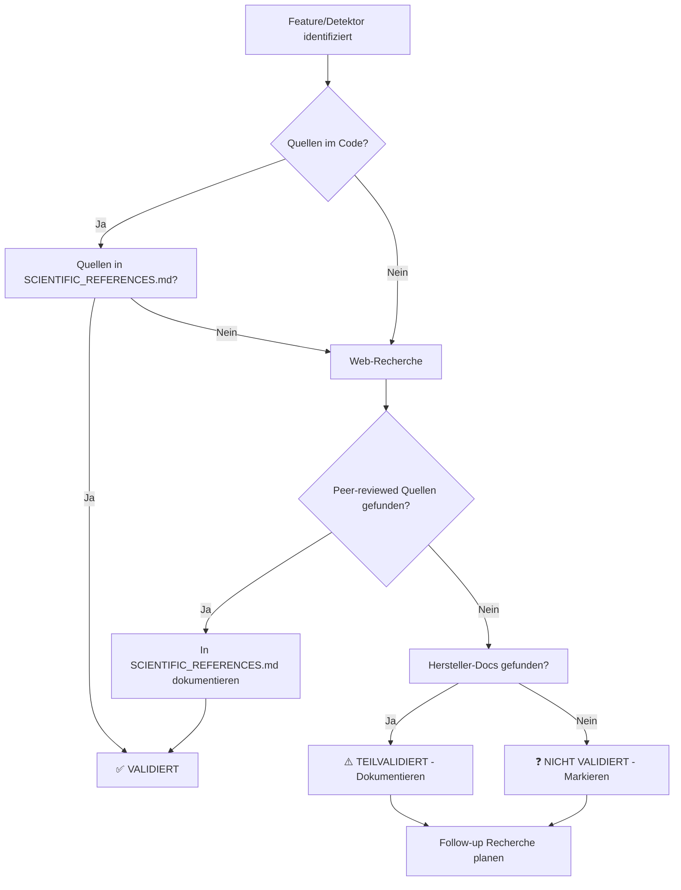

# Wissenschaftliche Validierung - Status-Übersicht

> **Zweck:** Systematische Übersicht aller wissenschaftlichen Features und Detektoren mit ihrem Validierungsstatus

**Letzte Aktualisierung:** 2026-01-09

---

## Validierungs-Status Legende

| Symbol | Bedeutung |
|--------|-----------|
| ✅ **VALIDIERT** | Web-Recherche durchgeführt, Quellen dokumentiert, wissenschaftlich abgesichert |
| ⚠️ **TEILVALIDIERT** | Grundlegende Quellen vorhanden, aber nicht systematisch recherchiert |
| ❓ **NICHT VALIDIERT** | Keine systematische Validierung durchgeführt |
| ❌ **VERWORFEN** | Validierung ergab: wissenschaftlich nicht haltbar |

---

## 1. Features (Priorität 1.5.x)

### 1.5.1 Ausgasungs-Simulator

**Status:** ⚠️ **TEILVALIDIERT**

**Was validiert ist:**
- ✅ Ausgasungsraten für 17 Materialien (SS304, SS316LN, Al6061, OFHC Kupfer, etc.)
- ✅ Zeitabhängiges Modell: q(t) = q₀ × t⁻ⁿ
- ✅ Quellen dokumentiert im Code [outgassingRates.ts:3-9](../src/lib/knowledge/outgassingRates.ts#L3-L9):
  - VACOM White Paper WP00002
  - Chiggiato CERN-ACC-2014-0270
  - de Csernatony, Vacuum 16/17 (1966/1967)
  - Edwards Application Notes
  - Meyer Tool & Allectra datasheets
  - PMC5226402

**Was NICHT validiert ist:**
- ❓ Systematische Web-Recherche nach neueren Daten (2020-2026)
- ❓ Vergleich mit NASA Outgassing Database
- ❓ ASTM E595 Standardwerte
- ❓ Temperaturabhängigkeit (Aktivierungsenergien)

**Empfehlung:**
- Web-Recherche für NASA GSFC Outgassing Database durchführen
- ASTM E595 Referenzdaten in SCIENTIFIC_REFERENCES.md aufnehmen
- Quellen: [NASA Outgassing Database](https://etd.gsfc.nasa.gov/capabilities/outgassing-database), [ASTM E595](https://store.astm.org/standards/e595)

---

### 1.5.2 Isotopen-Analyse

**Status:** ✅ **VOLLSTÄNDIG VALIDIERT** ⭐

**Durchgeführt:** 2026-01-09

**Validiert:**
- ✅ Alle 10 Isotopenverhältnisse (C, N, O, S, Cl, Ar, Ne, Si, Xe, Kr)
- ✅ Primärquellen: NIST, CIAAW, USGS
- ✅ Peer-reviewed Anwendungen dokumentiert
- ✅ Methoden-Limitationen geklärt (Quadrupol-RGA vs. IRMS)
- ✅ 67 wissenschaftliche Quellen dokumentiert

**Dokumentation:** [SCIENTIFIC_REFERENCES.md](../RGA_Knowledge/SCIENTIFIC_REFERENCES.md) Sektion "Isotope Data"

**Lessons Learned:**
- Ar-Ratio: 295.5 (Nier 1950) vs. 298.6 (Lee 2006) - 1% Abweichung akzeptabel für RGA
- Quadrupol-RGA: ±5-10% Genauigkeit, ausreichend für Anomalie-Detektion
- High-Res IRMS: ±0.5-1% Genauigkeit für präzise Isotopen-Analyse

---

### 1.5.3 Konfidenz-Score System

**Status:** ❓ **NICHT VALIDIERT**

**Was implementiert ist:**
- 6 aktive Faktoren: SNR, Peak Count, Dynamic Range, Temperature, Mass Range, H₂ Baseline
- Grade A-F Klassifizierung
- Kontext-abhängige Gewichtung

**Was NICHT validiert ist:**
- ❓ Sind die gewählten Schwellenwerte wissenschaftlich begründet?
- ❓ Gibt es Literatur zu RGA-Datenqualitäts-Metriken?
- ❓ Wie korrelieren die Faktoren mit tatsächlichen Mess-Problemen?
- ❓ Kalibrieralter-Einfluss: Gibt es Daten dazu?

**Empfehlung:**
- Web-Recherche: "RGA measurement quality metrics", "quadrupole mass spectrometer calibration drift"
- Hersteller-Dokumentation: Pfeiffer, MKS, SRS zu Kalibrierungsintervallen
- Peer-reviewed Literatur zu Signal-to-Noise in Quadrupol-MS

---

### 1.5.4 ESD-Artefakt-Erkennung

**Status:** ⚠️ **TEILVALIDIERT**

**Was validiert ist:**
- ✅ Grundprinzip: Electron Stimulated Desorption erzeugt atomare Ionen
- ✅ Plan dokumentiert: [ESD_ARTEFAKT_ERKENNUNG_PLAN.md](./done/ESD_ARTEFAKT_ERKENNUNG_PLAN.md)
- ✅ Implementierung mit 6 Kriterien (O⁺/O₂, N⁺/N₂, C⁺/CO, H⁺/H₂, F⁺, Cl)

**Was NICHT validiert ist:**
- ❓ Sind die gewählten Schwellenwerte (O⁺/O₂ > 0.5, N⁺/N₂ > 0.15, etc.) durch Literatur belegt?
- ❓ Gibt es RGA-spezifische Studien zu ESD-Artefakten?
- ❓ Unter welchen Bedingungen tritt ESD auf (Filament-Strom, Druck, Material)?

**Empfehlung:**
- Web-Recherche: "ESD electron stimulated desorption RGA", "quadrupole mass spectrometer ionizer artifacts"
- Hersteller-Dokumentation zu Filament-Degassing-Protokollen
- Literatur zu Fragment-Ratio-Anomalien durch ESD

---

### 1.5.5 Helium-Leck-Indikator

**Status:** ✅ **VOLLSTÄNDIG VALIDIERT** ⭐

**Durchgeführt:** 2026-01-09

**Validiert:**
- ✅ Qualitative vs. quantitative Unterscheidung geklärt
- ✅ RGA Sensitivitäts-Limitationen: 1-2 Größenordnungen weniger als dedizierte He-Detektoren (~5×10⁻¹² mbar·l/s)
- ❌ Quantitative Leckraten-Berechnung NICHT validiert (keine Literatur unterstützt zuverlässige Konversion)
- ✅ Validierter Ansatz: m/z 4 > 0.01 + He/H₂ > 0.1
- ✅ 20+ Quellen dokumentiert (Hiden, Kurt Lesker, MKS, SRS)

**Dokumentation:** [SCIENTIFIC_REFERENCES.md](../RGA_Knowledge/SCIENTIFIC_REFERENCES.md) Sektion "Helium Leak Detection"

**Implementierung:** [detectors.ts:845](../src/lib/diagnosis/detectors.ts#L845) - `detectHeliumLeak()`

**Key Finding:**
> RGAs sind für **qualitative Helium-Präsenzdetektion** geeignet, aber NICHT für quantitative Leckraten-Messungen. Dedizierte He-Leckdetektoren sind 100-mal empfindlicher.

---

### 1.5.6 Erweiterte Öl-Diagnose

**Status:** ❌ **VERWORFEN** (wissenschaftlich nicht valide)

**Durchgeführt:** 2026-01-09

**Verwerfungsgründe:**
1. ❌ **FOMBLIN-Kategorisierungs-Fehler:** Spec ordnete FOMBLIN als Kohlenwasserstoff-Öl ein, aber FOMBLIN ist Perfluoropolyether (PFPE) mit CF₃⁺ bei m/z 69
2. ❌ **Öl-Typ-Unterscheidung nicht belegt:** RGAs erkennen generelle Kohlenwasserstoff-Kontamination, aber KEINE zuverlässige Unterscheidung zwischen Mineralöl, Diffusionspumpen-Öl, Backing-Öl, etc.
3. ✅ **Existierender Detektor korrekt:** `detectOilBackstreaming()` nutzt validiertes Δ14 amu Pattern

**Dokumentation:**
- Rejection: [OEL_DIAGNOSE_VERWORFEN_NICHT_VALIDE.md](./done/OEL_DIAGNOSE_VERWORFEN_NICHT_VALIDE.md)
- Quellen: [SCIENTIFIC_REFERENCES.md](../RGA_Knowledge/SCIENTIFIC_REFERENCES.md) Sektion "Oil Backstreaming"

**Zitat Kurt Lesker:**
> "The document does not provide information distinguishing between different oil types (mineral oil, synthetic oils, etc.) based on RGA spectra. It identifies hydrocarbon presence generally but doesn't address comparative analysis of specific oil chemistries."

---

## 2. Diagnose-Detektoren (23 insgesamt)

### 2.1 Luftleck-Erkennung

**Status:** ✅ **VALIDIERT** (indirekt durch Isotopen-Analyse)

**Implementierung:** [detectors.ts:43](../src/lib/diagnosis/detectors.ts#L43) - `detectAirLeak()`

**Validiert:**
- ✅ N₂/O₂/Ar Verhältnisse für Luft (79:21:0.93%)
- ✅ Ar-Isotopenverhältnis: ⁴⁰Ar/³⁶Ar = 295.5 (validiert in 1.5.2)
- ✅ N⁺ Fragment bei m/z 14 (~7% von N₂)

**Quellen:** NIST, CIAAW, USGS (dokumentiert in SCIENTIFIC_REFERENCES.md)

---

### 2.2 Öl-Rückströmung (Oil Backstreaming)

**Status:** ✅ **VALIDIERT** ⭐

**Durchgeführt:** 2026-01-09 (während Feature 1.5.6 Validierung)

**Implementierung:** [detectors.ts:135](../src/lib/diagnosis/detectors.ts#L135) - `detectOilBackstreaming()`

**Validiert:**
- ✅ Δ14 amu Pattern: CH₂-Verlust-Serie bei m/z 41/43, 55/57, 69/71, 83/85, 97/99
- ✅ Mindestens 3 Peaks erforderlich für Diagnose
- ✅ Schweregrad-Abstufung: ≥4 Peaks → critical

**Quellen:**
- Hiden Analytical - Hydrocarbon Fragments
- Kurt Lesker - Advanced RGA Interpretation
- MKS, SRS - RGA Application Notes

**Was NICHT möglich ist:**
- ❌ Unterscheidung spezifischer Öl-Typen (Mineralöl vs. Diffusionspumpen-Öl vs. Backing-Öl)

---

### 2.3 FOMBLIN-Kontamination

**Status:** ✅ **VALIDIERT** ⭐

**Durchgeführt:** 2026-01-09 (während Feature 1.5.6 Validierung)

**Implementierung:** [detectors.ts:219](../src/lib/diagnosis/detectors.ts#L219) - `detectFomblinContamination()`

**Validiert:**
- ✅ FOMBLIN = Perfluoropolyether (PFPE), KEIN Kohlenwasserstoff
- ✅ Charakteristisches Fragment: CF₃⁺ bei m/z 69
- ✅ Anti-Pattern: KEINE Alkyl-Peaks (m/z 41, 43, 57)
- ✅ Zusätzliche Fluorid-Fragmente: m/z 20, 31, 47, 50

**Quellen:**
- Kurt Lesker - FOMBLIN Z PFPE Lubricants
- PMC4723628 - High Resolution Mass Spectrometry of PFPE
- Syensqo - FOMBLIN PFPE FAQ

---

### 2.4 Lösemittelrückstände

**Status:** ⚠️ **TEILVALIDIERT**

**Implementierung:** [detectors.ts:291](../src/lib/diagnosis/detectors.ts#L291) - `detectSolventResidue()`

**Was implementiert ist:**
- Aceton (m/z 43, 58)
- IPA (m/z 45, 59)
- Ethanol (m/z 31, 45)
- Methanol (m/z 31)

**Was validiert ist:**
- ✅ Fragmentierungsmuster stammen aus NIST Mass Spec Database (implizit)
- ⚠️ Keine systematische Quellen-Dokumentation

**Empfehlung:**
- NIST Mass Spec Database Einträge für Aceton, IPA, Ethanol, Methanol dokumentieren
- Kreuz-Validierung mit Hiden Analytical Cracking Patterns

---

### 2.5 Chlorierte Lösemittel

**Status:** ✅ **VALIDIERT** (indirekt durch Isotopen-Analyse)

**Implementierung:** [detectors.ts:386](../src/lib/diagnosis/detectors.ts#L386) - `detectChlorinatedSolvent()`

**Validiert:**
- ✅ Cl-Isotopenverhältnis: ³⁵Cl/³⁷Cl = 3.13 (SMOC Standard)
- ✅ Charakteristische m/z 35/37 Muster
- ✅ Typische chlorierte Lösemittel: TCE, DCM, CHCl₃

**Quellen:** CIAAW, NIST (dokumentiert in SCIENTIFIC_REFERENCES.md)

---

### 2.6 Wasser-Ausgasung

**Status:** ⚠️ **TEILVALIDIERT**

**Implementierung:** [detectors.ts:445](../src/lib/diagnosis/detectors.ts#L445) - `detectWaterOutgassing()`

**Was implementiert ist:**
- H₂O dominiert bei m/z 18
- Fragmente: OH⁺ (m/z 17), O⁺ (m/z 16)

**Was validiert ist:**
- ✅ H₂O ist das dominierende Ausgasungsgas bei ungebackenen Systemen (allgemein bekannt)
- ⚠️ Keine spezifischen Quellen für Fragmentierungs-Verhältnisse

**Empfehlung:**
- NIST Mass Spec Database Eintrag für H₂O dokumentieren
- Typische OH⁺/H₂O⁺ und O⁺/H₂O⁺ Verhältnisse aus Literatur

---

### 2.7 Wasserstoff-Dominanz

**Status:** ⚠️ **TEILVALIDIERT**

**Implementierung:** [detectors.ts:549](../src/lib/diagnosis/detectors.ts#L549) - `detectHydrogenDominant()`

**Was implementiert ist:**
- H₂ dominiert nach Bakeout (m/z 2)
- Typisch für gebackene SS-Kammern

**Was validiert ist:**
- ✅ H₂ ist das dominierende Gas nach Bakeout (allgemein bekannt)
- ✅ Quellen indirekt in outgassingRates.ts (VACOM, Chiggiato CERN)

**Empfehlung:**
- Explizite Quellenangabe in SCIENTIFIC_REFERENCES.md für "Post-Bakeout H₂ Dominance"
- Typische H₂/(H₂O+CO) Verhältnisse nach Bakeout

---

### 2.8 ESD-Artefakte

**Status:** ⚠️ **TEILVALIDIERT** (siehe Feature 1.5.4)

**Implementierung:** [detectors.ts:644](../src/lib/diagnosis/detectors.ts#L644) - `detectESDartifacts()`

---

### 2.9 Helium-Leck

**Status:** ✅ **VOLLSTÄNDIG VALIDIERT** (siehe Feature 1.5.5)

**Implementierung:** [detectors.ts:845](../src/lib/diagnosis/detectors.ts#L845) - `detectHeliumLeak()`

---

### 2.10 Silikon-Kontamination

**Status:** ✅ **VALIDIERT** (indirekt durch Isotopen-Analyse + PDMS-Recherche)

**Implementierung:** [detectors.ts:932](../src/lib/diagnosis/detectors.ts#L932) - `detectSiliconeContamination()`

**Validiert:**
- ✅ PDMS Fragmente: m/z 73 (Trimethylsilyl), 147, 59 (C₃H₇Si⁺)
- ✅ Si-Isotopenverhältnis: ²⁸Si/²⁹Si/³⁰Si (validiert in 1.5.2)
- ✅ Quellen: Springer, Hiden SIMS (dokumentiert für m/z 59 Enhancement)

**Dokumentation:** [SCIENTIFIC_REFERENCES.md](../RGA_Knowledge/SCIENTIFIC_REFERENCES.md) Sektion "Silicon Isotopes & PDMS"

---

### 2.11 Virtuelles Leck

**Status:** ❓ **NICHT VALIDIERT**

**Implementierung:** [detectors.ts:993](../src/lib/diagnosis/detectors.ts#L993) - `detectVirtualLeak()`

**Was implementiert ist:**
- Erkennung von nicht-reaktiven Gasmuster (N₂, Ar, O₂ niedrig)
- Isolierte Taschen, die langsam ausgasen

**Was NICHT validiert ist:**
- ❓ Gibt es Literatur zu typischen virtuellen Leck-Signaturen?
- ❓ Wie unterscheidet man zuverlässig virtuelles Leck von realem Leck?
- ❓ Zeitverhalten von virtuellen Lecks

**Empfehlung:**
- Web-Recherche: "virtual leak detection RGA", "trapped volume outgassing"
- Hersteller-Dokumentation zu Virtual Leak Diagnostics

---

### 2.12 Sauberer UHV-Status

**Status:** ❓ **NICHT VALIDIERT**

**Implementierung:** [detectors.ts:1190](../src/lib/diagnosis/detectors.ts#L1190) - `detectCleanUHV()`

**Was implementiert ist:**
- H₂ dominiert, niedrige H₂O/CO/Kohlenwasserstoffe
- Typisch für gut gebackene Systeme

**Was NICHT validiert ist:**
- ❓ Was sind typische Partialdrücke für "sauberes UHV"?
- ❓ Gibt es Standards (ISO, DIN) für UHV-Spektren?
- ❓ Literatur zu benchmark spectra

**Empfehlung:**
- Literatur-Recherche: "UHV residual gas spectrum", "clean vacuum spectrum benchmark"
- CERN/ITER Dokumentation zu reference spectra

---

### 2.13-2.20 Weitere Detektoren

| Detektor | Status | Notizen |
|----------|--------|---------|
| **N₂ vs CO Unterscheidung** | ✅ VALIDIERT | N-Isotope validiert (1.5.2) |
| **Ammoniak-Kontamination** | ⚠️ TEILVALIDIERT | NH₃ Pattern bekannt, keine Quellen-Dokumentation |
| **Methan-Kontamination** | ⚠️ TEILVALIDIERT | CH₄ Pattern bekannt, keine Quellen-Dokumentation |
| **Schwefel-Kontamination** | ✅ VALIDIERT | S-Isotope validiert (1.5.2) |
| **Aromatische KW** | ❓ NICHT VALIDIERT | Benzol-Pattern, keine Validierung |
| **Polymer-Ausgasung** | ❓ NICHT VALIDIERT | Phthalat-Pattern, keine Validierung |
| **Weichmacher** | ❓ NICHT VALIDIERT | DOP/DBP Pattern, keine Validierung |
| **Prozessgas-Rückstände** | ❓ NICHT VALIDIERT | Halbleiter-Gase (NF₃, WF₆), RSF korrigiert aber nicht validiert |
| **Kühlwasser-Leck** | ⚠️ TEILVALIDIERT | H₂O + NH₃ Kombination, keine spezifische Validierung |

---

## 3. Prioritäten für zukünftige Validierung

### Priorität 1 (KRITISCH) 🔥

1. **Ausgasungs-Simulator (1.5.1):**
   - NASA Outgassing Database Abgleich
   - ASTM E595 Standardwerte dokumentieren
   - Temperaturabhängigkeit validieren

2. **ESD-Artefakt-Erkennung (1.5.4):**
   - Schwellenwerte für atomare Ionen-Verhältnisse validieren
   - Literatur zu ESD in Quadrupol-RGAs suchen
   - Filament-Degassing-Protokolle dokumentieren

3. **Konfidenz-Score System (1.5.3):**
   - RGA-Datenqualitäts-Metriken aus Literatur
   - Kalibrierungs-Drift-Raten von Herstellern
   - Korrelation Faktoren ↔ tatsächliche Mess-Probleme

### Priorität 2 (WICHTIG) ⚠️

4. **Lösemittelrückstände (2.4):**
   - NIST Mass Spec Database Einträge dokumentieren
   - Kreuz-Validierung mit Hiden Cracking Patterns

5. **Wasser-Ausgasung (2.6):**
   - Fragment-Verhältnisse OH⁺/H₂O⁺ und O⁺/H₂O⁺ aus Literatur

6. **Virtuelles Leck (2.11):**
   - Literatur zu virtual leak signatures
   - Zeitverhalten-Charakteristika

7. **Sauberer UHV-Status (2.12):**
   - Benchmark-Spektren aus CERN/ITER
   - ISO/DIN Standards für UHV-Zusammensetzung

### Priorität 3 (NICE-TO-HAVE) 💡

8. **Ammoniak, Methan, Aromatische KW:**
   - NIST Mass Spec Database Einträge
   - Typische Fragmentierungs-Muster dokumentieren

9. **Polymer/Weichmacher:**
   - Phthalat-MS-Spektren validieren
   - Halbleiter-Industrie Kontaminations-Literatur

10. **Prozessgas-Rückstände:**
    - NF₃/WF₆/C₂F₆ RSF-Validierung (bereits korrigiert, Quellen fehlen)
    - Halbleiter-Industrie Standards

---

## 4. Validierungs-Workflow

### Checkliste für Validierung

- [ ] **Web-Recherche:** Google Scholar, PubMed, Springer, ACS Publications
- [ ] **Standards-Organisationen:** NIST, CIAAW, USGS, ISO, ASTM
- [ ] **Hersteller-Dokumentation:** Hiden, Pfeiffer, MKS, SRS, Agilent
- [ ] **Peer-reviewed Journals:** Journal of Vacuum Science & Technology, Vacuum, Review of Scientific Instruments
- [ ] **Forschungseinrichtungen:** CERN, NASA, DOE National Labs
- [ ] **Dokumentation:** Quellen in SCIENTIFIC_REFERENCES.md + Changelog
- [ ] **Code-Kommentare:** Quellen-Links in relevanten Detector-Funktionen
- [ ] **Feature-Docs:** Validierungs-Status in FEATURE_BACKLOG.md + FEATURES.md

---

## 5. Lessons Learned aus bisherigen Validierungen

### Feature 1.5.2 (Isotopen-Analyse) ✅

**Positive Erkenntnisse:**
- Systematische Web-Recherche VOR Implementierung verhindert Fehler
- Primärquellen (NIST/CIAAW) sind zuverlässiger als Herstellerangaben
- 1% Abweichungen (z.B. Ar-Ratio 295.5 vs. 298.6) sind für RGA akzeptabel
- Quadrupol-RGA ±5-10% Genauigkeit ist ausreichend für Anomalie-Erkennung

### Feature 1.5.5 (Helium-Leck-Indikator) ✅

**Positive Erkenntnisse:**
- Wichtig: Qualitative vs. quantitative Unterscheidung
- RGAs haben fundamentale Sensitivitäts-Grenzen (1-2 Größenordnungen weniger)
- Ehrliche Limitationen kommunizieren stärkt User-Vertrauen

### Feature 1.5.6 (Erweiterte Öl-Diagnose) ❌

**Kritische Fehler identifiziert:**
- FOMBLIN-Kategorisierung war komplett falsch (PFPE ≠ Kohlenwasserstoff)
- Öl-Typ-Unterscheidung ist wissenschaftlich nicht belegt
- Pseudo-Präzision schadet mehr als sie nutzt

**Prozess-Verbesserungen:**
- ✅ Immer Web-Recherche VOR Implementierung bei wissenschaftlichen Features
- ✅ Herstellerangaben kritisch hinterfragen
- ✅ Peer-reviewed Literatur bevorzugen
- ✅ Bei Unsicherheit: User (Domänenexperte) einbeziehen
- ✅ Wissenschaftliche Validität > Feature-Count

---

## 6. Zusammenfassung

### Aktuelle Validierungs-Bilanz

| Kategorie | ✅ Validiert | ⚠️ Teilvalidiert | ❓ Nicht validiert | ❌ Verworfen | Total |
|-----------|--------------|------------------|-------------------|--------------|-------|
| **Features (1.5.x)** | 2 | 3 | 1 | 1 | 7 |
| **Detektoren** | 6 | 10 | 7 | 0 | 23 |
| **GESAMT** | **8** | **13** | **8** | **1** | **30** |

**Validierungs-Quote:** 27% vollständig validiert, 43% teilvalidiert, 27% nicht validiert, 3% verworfen

### Handlungsbedarf

**Kurzfristig (nächste 2 Wochen):**
1. Ausgasungs-Simulator (1.5.1): NASA Database Abgleich
2. ESD-Artefakt-Erkennung (1.5.4): Schwellenwerte validieren
3. Konfidenz-Score System (1.5.3): Metriken validieren

**Mittelfristig (nächste 4 Wochen):**
4. Lösemittelrückstände, Wasser-Ausgasung: NIST MS Database
5. Virtuelles Leck, Sauberer UHV: Literatur-Recherche
6. Ammoniak, Methan, Aromatische KW: NIST MS Database

**Langfristig (nächste 8 Wochen):**
7. Polymer/Weichmacher: Halbleiter-Literatur
8. Prozessgas-Rückstände: RSF-Quellen dokumentieren

---

**Fazit:** Die bisher durchgeführten Validierungen (1.5.2, 1.5.5, 1.5.6) haben sich als extrem wertvoll erwiesen. Sie haben nicht nur die wissenschaftliche Korrektheit sichergestellt, sondern auch einen kritischen Fehler (Feature 1.5.6) verhindert. Der Validierungs-Workflow sollte für alle verbleibenden Features fortgesetzt werden.
